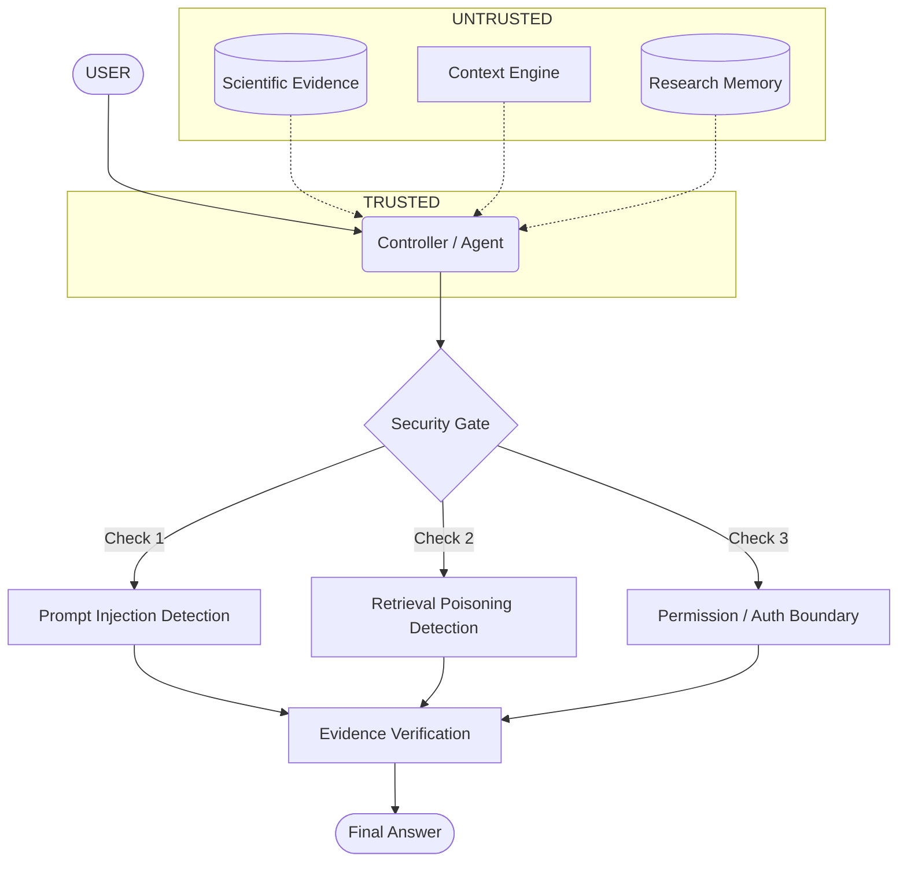

# Security Extension Architecture

**Phase 12**

## Threat Model Mapping

| Security Control | Implementation | Threat Addressed | Test Coverage | Status |
| :--- | :--- | :--- | :--- | :--- |
| **Sanitization & Stripping** | `security/sanitizer.py` (Existing) | Injection Markers / XSS / PHI | `test_sanitizer.py` | VALIDATED |
| **Prompt Injection Defense** | `PromptInjectionDetector` (New Extension) | Malicious Evidence/Context | `test_prompt_injection_detection` | DEVELOPED |
| **Retrieval Poisoning Defense**| `RetrievalPoisoningDetector` (New Extension) | Document Provenance Spoofing | `test_poisoning_detector_*` | DEVELOPED |
| **Context/Memory Boundary** | `AuthorizationBoundary` (New Extension) | Policy Overrides / Escaping | `test_policy_context_cannot_alter_policy` | DEVELOPED |
| **Tool/Permission Boundary** | `AuthorizationBoundary` (New Extension) | Unauthorized Action Execution | `test_policy_untrusted_data_no_tool_permission` | DEVELOPED |

## Data Flow Architecture

## Security Posture

- **TRUSTED**: Agent Controller, System Prompts.
- **UNTRUSTED**: User Query, Retrieved Evidence, Session Context, Research Memory.
- **CONTROL PLANE**: Can invoke tools, modify trust/experiment weights.
- **DATA PLANE**: Inert storage. Cannot invoke tools. Cannot execute instructions.
