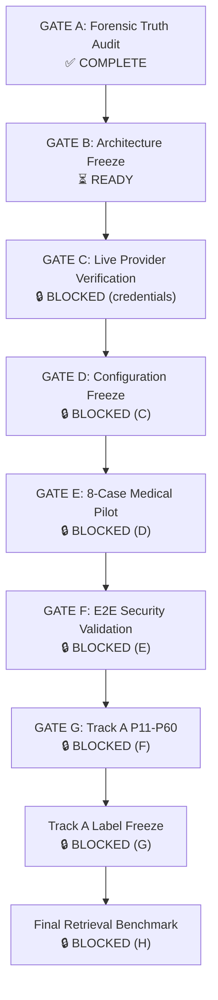

# ARCHITECTURE_REMAINING_GATES_V1

**Date:** 2026-10-03  
**Architecture Status:** CONCEPTUALLY FROZEN  
**Current Stage:** GATE A (Forensic Truth Audit) — COMPLETE

---

## Gate Sequence

---

## GATE A: Forensic Truth Audit ✅ COMPLETE

**Output:** `ARCHITECTURE_TRUTH_STATUS_V1.md` + `.json`

### Findings
1. **LIVE_SOURCE_QUERY corrected from YES to NO** — orchestrator retrieves from frozen in-memory corpus, not live APIs
2. **AnswerSafetyGate corrected from UNVERIFIED to INTEGRATION_TESTED** — actually imported and called in orchestrator
3. **API adapters corrected from CONCEPTUAL to MOCK_TRANSPORT_TESTED** — 4 of 5 adapters have real httpx code with snapshot tests
4. **Trust MISSING=ZERO documented** — `query_relevance` (weight 0.10-0.20) and `evidence_quality` (weight 0.10-0.25) silently default to 0.0
5. **anti_injection incorrectly sources from poisoning_score** — should derive from injection detection result
6. **DynamicIntegrityValidator is CODE_PRESENT only** — implemented but never wired into orchestrator default; no tests
7. **RelationshipGroundingV2 is UNIT_TESTED only** — not wired into orchestrator default; only isolated unit tests
8. **ContradictionAnalyzer class does NOT EXIST** — contradiction detection is a function in claim_verifier.py

### Fixes Applied
- ARCHITECTURE_TRUTH_STATUS_V1 created with evidence-backed statuses
- No hard-coded PASS values
- Every component classified with file/line evidence

### Fixes NOT Applied (and why)
- Trust MISSING=ZERO: **Not fixed.** Requires research protocol decision on imputation vs exclusion. This is a design decision, not a code bug to silently patch.
- `anti_injection` sourcing: **Not fixed.** Requires orchestrator change and trust revalidation. Documenting for Gate B.
- DynamicIntegrityValidator wiring: **Not fixed.** Optional injected component; requires evaluation of whether default-on is safe.
- RelationshipGroundingV2 wiring: **Not fixed.** Same — requires evaluation before default activation.

---

## GATE B: Architecture Freeze ⏳ READY

**Prerequisite:** Gate A complete  
**Status:** Ready to execute

### Required Actions
1. Freeze `ARCHITECTURE_TRUTH_STATUS_V1.md` as canonical reference
2. Record the trust MISSING=ZERO finding as a **known limitation** in the architecture document
3. Decide: should `DynamicIntegrityValidator` and `RelationshipGroundingV2` be wired by default?
4. Update `CANONICAL_MEDICAL_RAG_ARCHITECTURE_V1.md` to match truth status
5. Create `ARCHITECTURE_FREEZE_CERTIFICATE_V1.md`

### Decision Required
- **Trust imputation policy:** Define what happens to `query_relevance` and `evidence_quality` formally
  - Option A: Impute from retrieval similarity score (populated at scoring time)
  - Option B: Exclude from formula and redistribute weights
  - Option C: Document as known limitation and proceed

---

## GATE C: Live Provider Verification 🔒 BLOCKED

**Prerequisite:** Gate B complete + API credentials  
**Blocker:** No provider credentials currently present

### Required Sequence
1. Provision ONE provider credential (Groq recommended — free tier, OpenAI-compatible)
2. Run non-medical transport test
3. Verify: provider identity, model identity, model revision
4. Verify: structured JSON output mode
5. Verify: temperature, max_tokens, timeout behavior
6. Verify: no silent model fallback
7. Capture: request metadata, response metadata, HTTP status

### Required Output
- `documentation/llm/LLM_PROVIDER_VERIFICATION_V1.md`
- `documentation/llm/LLM_PROVIDER_VERIFICATION_V1.json`
- Or: `documentation/llm/LLM_PROVIDER_BLOCKED_REPORT_V1.md` if credentials absent

---

## GATE D: Configuration Freeze 🔒 BLOCKED

**Prerequisite:** Gate C passes

### Required Freeze
- provider, gateway, model, revision
- endpoint, structured-output mode
- temperature, max_tokens, timeout, retry
- fallback policy (DISABLED)
- system prompt hash, adjudication prompt hash, schema hash

### Required Output
- `TRACK_A_LLM_EXECUTION_CONFIG_FROZEN.json`
- Reproducibility manifest

---

## GATE E: 8-Case Medical Pilot 🔒 BLOCKED

**Prerequisite:** Gate D complete

### Required Validation Per Case
- JSON validity, full schema validity
- All 21 required fields present
- Enum validity (labels, grades, alignments)
- Label/grade consistency
- Exact supporting span (substring check)
- Evidence claim spans
- Relationship alignment, polarity
- Alternative label, rationale, confidence

### Required Output
- `documentation/llm/MEDICAL_LLM_PILOT_V1.md`
- `documentation/llm/MEDICAL_LLM_PILOT_V1.json`
- **HUMAN REVIEW GATE** — do not auto-proceed to P11-P60

---

## GATE F: E2E Security Validation 🔒 BLOCKED

**Prerequisite:** Gate E validated by human

### Required Test
- 10 adversarial prompt-injection cases
- 3 clean controls
- Full pipeline: detector → retrieval → trust → eligibility → generation → verification → abstention

### Required Output
- Actual observed Attack Success Rate (never inferred from component tests)
- `documentation/security/E2E_SECURITY_VALIDATION_V1.md`

---

## GATE G: Track A P11-P60 🔒 BLOCKED

**Prerequisite:** Gate F complete

### Rules
- Use frozen configuration from Gate D
- Preserve original position IDs
- Human decision ≠ LLM proposal
- Do not modify previously committed annotations

---

## Track A Label Freeze 🔒 BLOCKED

**Prerequisite:** All 530 positions annotated + QA + adjudication

---

## Final Retrieval Benchmark 🔒 BLOCKED

**Prerequisite:** Track A labels frozen

### Methodology
- Baseline (BM25 + S-PubMedBERT + RRF + MedCPT) vs Cognee-enabled
- Metrics: RAGAS/DeepEval if required by frozen protocol
- Account for 9-query clustering in statistical analysis

---

## Pending Work Register

| ID | Pending Item | Why Pending | Blocker | Next Action |
|---|---|---|---|---|
| ARCH-P01 | Trust MISSING=ZERO resolution | Design decision needed | Human review | Decide imputation policy |
| ARCH-P02 | `anti_injection` source correction | Uses poisoning_score instead of injection result | Gate B | Fix orchestrator L508 |
| ARCH-P03 | IntegrityValidator wiring decision | CODE_PRESENT only, not default-on | Gate B | Evaluate default activation |
| ARCH-P04 | RelationshipGroundingV2 wiring decision | UNIT_TESTED only, not default-on | Gate B | Evaluate default activation |
| ARCH-P05 | Live provider credential | No credentials present | External | Provision Groq API key |
| ARCH-P06 | Live provider transport test | Blocked by P05 | Gate C | Execute non-medical test |
| ARCH-P07 | Model/revision verification | Blocked by P06 | Gate C | Verify model identity |
| ARCH-P08 | Structured output verification | Blocked by P06 | Gate C | Test JSON Schema mode |
| ARCH-P09 | Configuration freeze | Blocked by P08 | Gate D | Freeze all parameters |
| ARCH-P10 | 8-case medical pilot | Blocked by P09 | Gate E | Run pilot batch |
| ARCH-P11 | E2E security evaluation | Blocked by P10 | Gate F | Run adversarial test |
| ARCH-P12 | Track A P11-P60 | Blocked by P11 | Gate G | Resume annotation |
| ARCH-P13 | Track A label freeze | Blocked by P12 | — | QA and freeze |
| ARCH-P14 | Final retrieval benchmark | Blocked by P13 | — | Run benchmark |
