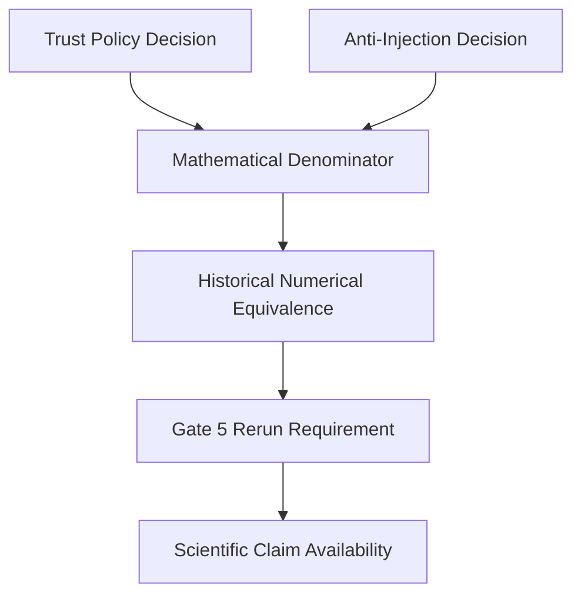

# GATE B RERUN DEPENDENCY VERIFICATION

**Date:** 2026-10-03  
**Stage:** GATE_B  

## 1. EQUIVALENCE TAXONOMY

A zero numerical difference DOES NOT automatically imply semantic or scientific equivalence.

- **A. NUMERICAL EQUIVALENCE:** Did two implementations output the same math? 
  *(Yes, for Anti-Inject Option A and Trust Option C on the safe frozen corpus. Output delta = 0).*
- **B. SEMANTIC EQUIVALENCE:** Do they mean the same thing? 
  *(No. Historical `1.0 - poisoning` meant "measured safety". Current `1.0` means "placeholder constant". They are semantically disjoint).*
- **C. IMPLEMENTATION EQUIVALENCE:** Do they execute the same logic path?
  *(No. The code was physically patched to remove the subtraction).*
- **D. SCIENTIFIC EQUIVALENCE:** Can the historical experiment serve as evidence for the current scientific claim?
  *(Yes, conditionally, if we accept that the semantic difference does not invalidate the numerical baseline comparison against Cognee).*

## 2. DECISION DEPENDENCY GRAPH

**Verification of `DECISION_DEPENDENCY = MATHEMATICAL_ONLY`:**
This is VERIFIED. The Trust Policy and Anti-Injection decisions only couple at the `Mathematical Denominator`. They do not logically force one another (e.g., choosing Trust C does not *require* choosing Anti-Inject A, but choosing anything else breaks the denominator and forces a rerun). 

## 3. RERUN CATEGORIES

- **MANDATORY RERUN:** Any mathematical shift in the denominator (Trust A/B or Anti-Inject B/C) renders the historical baseline scores invalid for comparison against future experimental branches (e.g., Cognee). The 92-run matrix MUST be re-executed.
- **NOT REQUIRED:** Trust C + Anti-Inject A perfectly maintains Numerical Equivalence for the safe baseline. The historical benchmark CSVs/JSONs remain mathematically perfectly valid as a baseline comparator.
